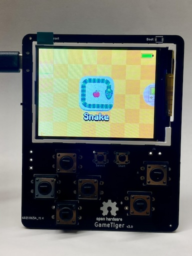

    

    

## About GameTiger Console
A retro-themed gaming console, crafted and tailored exclusively for educational enjoyment. The console boasts a custom-designed printed circuit board (PCB), meticulously created entirely from the ground up, and is centered around the remarkable RP2040 MCU chip. The primary objective of this endeavor is to maintain complete openness, facilitating the exploration of electronic PCB design and the establishment of a platform that fosters the creation of games and emulators on microcontrollers.

    
    

## Games
|   |   |
|---|---|
| Snake | 2048 |
|  |  
| Tetris | Minesweeper |
|  | 
| Tic Tac Toe | Ninja Frog |
|  | 

## Software
The software is constructed using the Pico C++ SDK, incorporating essential hardware interfacing functionalities. As an illustration, the well-known Snake game is already available. The following modules are currently available and are continually being developed.

* Operating System Drivers
    * Display driver
    * Button interrupts
    * Battery management system driver
* Framebuffer Library
    * Supports transparency
    * Streaming to display memory using DMA
    * Draw primitives (Line, Rect, Fill Rect)
    * Supports drawing images with alpha channel
* Sprite sheet 
    * Support for sprite sheet 
    * Basic tilemap support
* Font system based on Sprite sheet
* Menu system
    * Games
    * Hardware config
        * Display brightness
        * Display sleep time after inactivity

The software is well optimised to achieve a target of 30 frames per second. The Snake game achieves more than 44 FPS on a default settings without overclocking. 

Hardware V3:

Hardware V2:

Hardware V1:

## Build your favourite games
If you wish to contribute to this repo, please feel free to implement your favourite games and send a pull request. 

## To Do
* Add more games
* Design Case in CAD software for 3d printing

## License
The entire project is open-sourced software licensed under the MIT license.

## References
* [Hardware Design with RP2040](https://datasheets.raspberrypi.com/rp2040/hardware-design-with-rp2040.pdf)
* [Minimal RP2040 Board](http://www.technoblogy.com/show?3U75)
* [HAGL Graphics Library](https://github.com/tuupola/hagl)
* [PCB Design for RP2040 youtube video](https://www.youtube.com/watch?v=kcwvuwetgEQ)